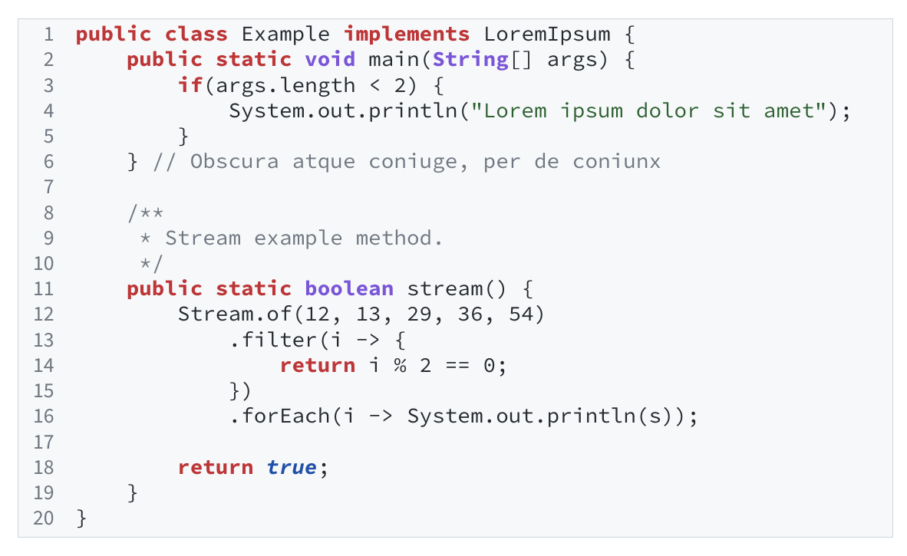
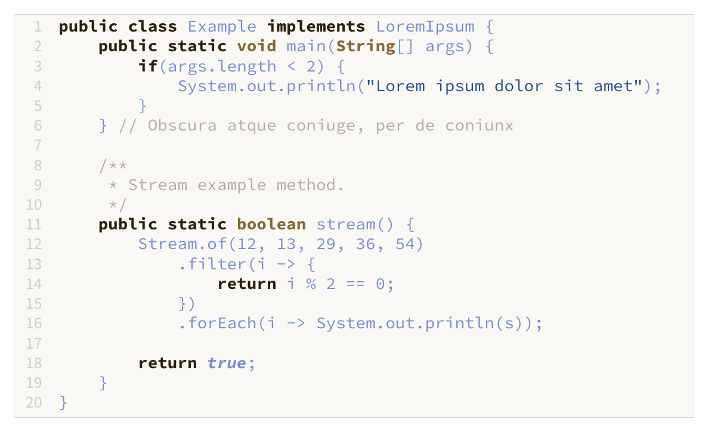

# Latex Listings Themes

A list of themes or styles for the LaTeX package listings.

## Themes

### Atom One Light

### Ayu

### Black And White

### Brackets Light Pro

### Eclipse

### Eisvogel

### GitHub

### Gruvbox Light

### IntelliJ Light

### Monokai Light

### Solarized Light

### Stackoverflow

### Two Firewatch Light

## License

This project is open source licensed under the BSD 3-Clause License. Please see the [LICENSE file](LICENSE) for more information.
